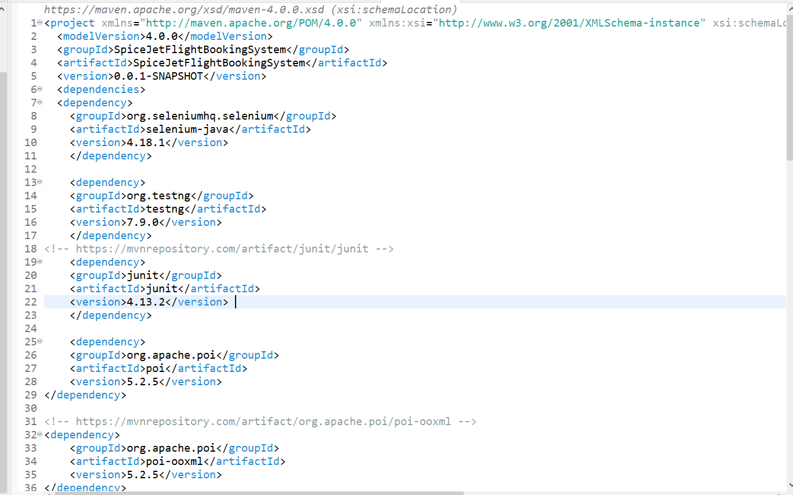
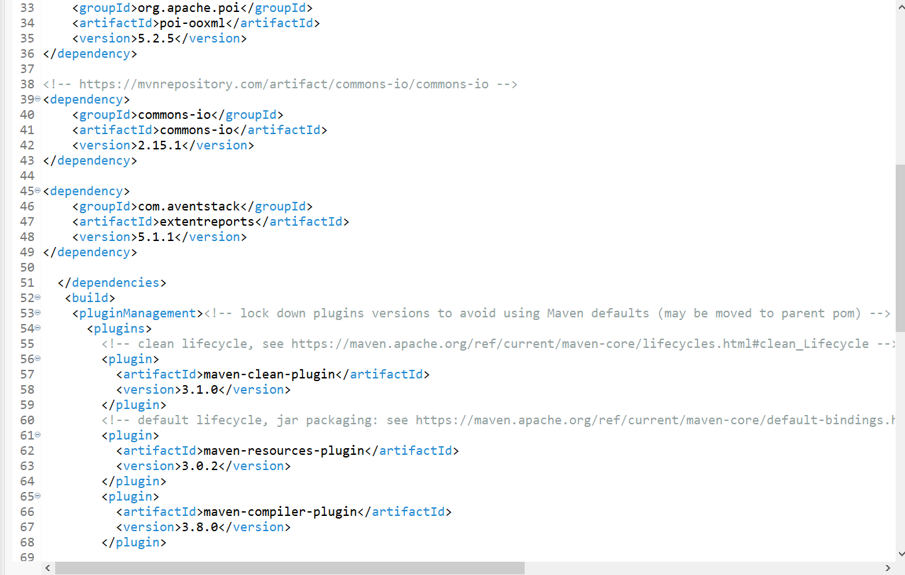
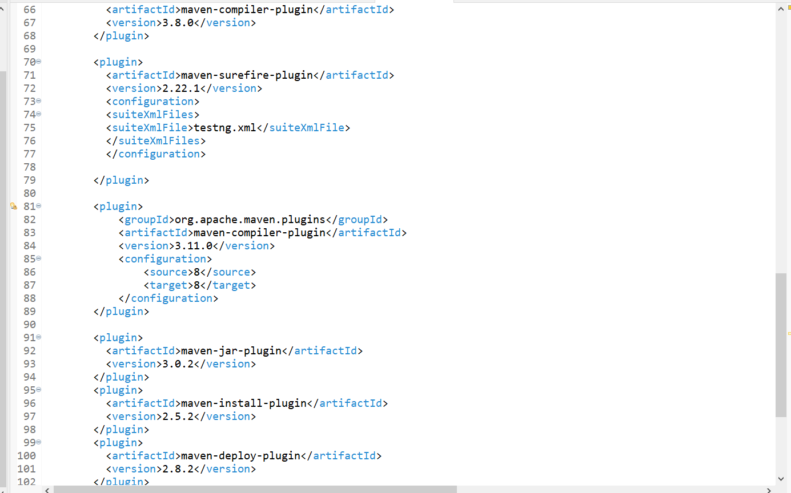
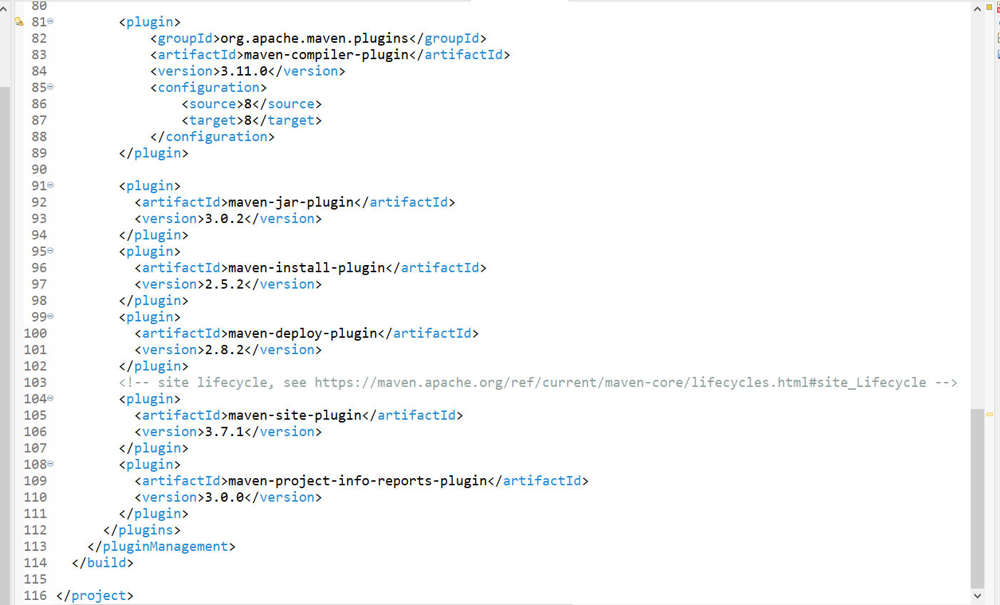
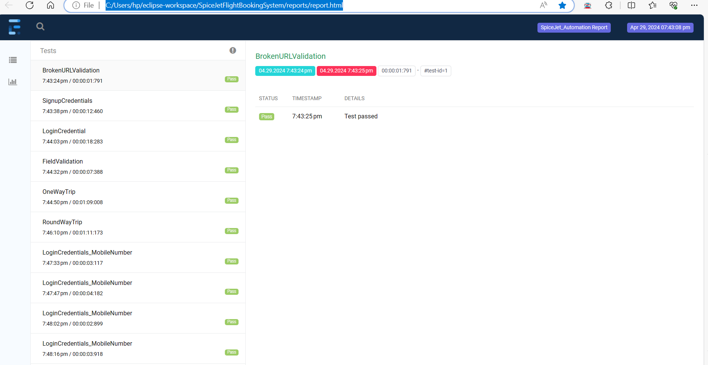
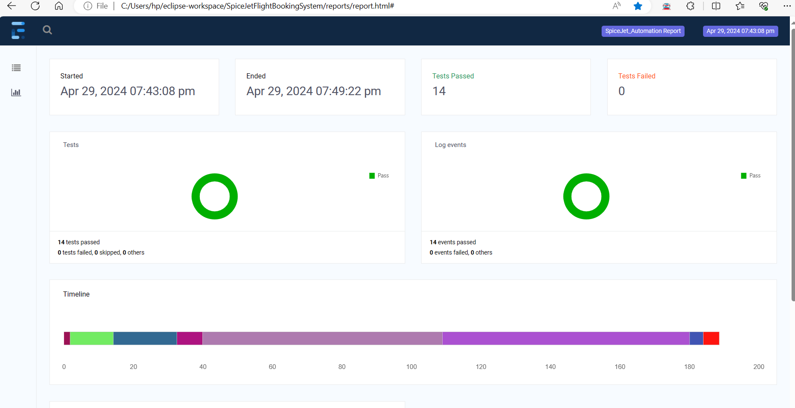

# SpiceJet-Capstone-project


The Project is to build a system that can automatically test the major functionalities of the SpiceJet Flight ticket booking website. I have used Data-Driven testing for testing Sign In functionality with the Data provider and also it covers the main features of One trip and Round trip as well.

## Coding Style:
- I have used Java Programming language with POM(Page Object Model) design pattern with Selenium framework in this project.

## IDE/Language:
- IDE: Eclipse
- Language: Java
## Technology/Frameworks used:
- TestNG framework - Used for various purposes like Data provider and the prioritization of tests and suites.
- Extent reports library - Used for the detailed reporting of the test cases status with various information     like screenshots.
- Maven project - For the ease of handling the dependencies in one place.
- Selenium Java library - Selenium provides support for the automation of web browsers. It provides extensions to emulate user interaction with browsers, a distribution server for scaling browser allocation, and the infrastructure for implementations of the W3C WebDriver specification.
- Apache POI library- For the reading and writing the data in an Excel sheet.
- Maven Surefire plugin- For the building of a Maven build and for Jenkins CI/CD implementation for invoking the build by local host or remotely.
- Jenkins tool - For triggering the build eventually executing the tasks locally or remotely.
- WebDriverManager library - Automated driver management and other helper features for Selenium WebDriver in Java.

  ## Steps to create the project and adding dependencies:
- Step 1: Create a new project of type Maven in Eclipse IDE.
- Step 2: Then add a testNG library by navigating to the Java build path and adding the testNG library. Then Apply and close.
- Step 3: The next step is to add the important dependencies in the Pom.xml file(refer to the below dependencies screenshot).
- Step 4: Since we are following the POM design pattern we need to create four packages(refer to the below POM screenshot).
- Step 5: Finally, add the Maven sure surefire plugin in the Pom.xml file under tag <build></build>(refer to the below Maven surefire screenshot).
- Step 6: Create a new testng.xml file adding the test java classes to be executed under suite.
- Step 7: Run the project a testNG suite.

## Dependencies screenshot:
<p align="Left"></p>
<p align="Left"></p>
<p align="Left"></p>
<p align="Left"></p>

## POM file screenshot:
<p align="Left"></p>


## Test case Code Example:
- I have used constructor chaining here in order to access the methods of pages with single object creation.
- We are using try/catch to handle the exception that occurs in between the process of executing a test case.
- Finally, based on the validation if the test case is passed we report that test case as Pass/Fail in extent report.


## Test Scenarios covered:
- Checked Given URL is broken or not
- Field validation on the home page 
- Bottom Links are displayed properly 
- Login scenarios(Positive and Negative)
- SignUp scenarios(Positive and Negative)
- One-Way trip scenario
- Round trip scenario 

## Maven output Build success screenshot:
 


## Jenkins output Build success screenshot:


## Extent report screenshots:
<p align="Left"></p>
<p align="Left"></p>
## People who worked on this project
```Venkatesh JM```
